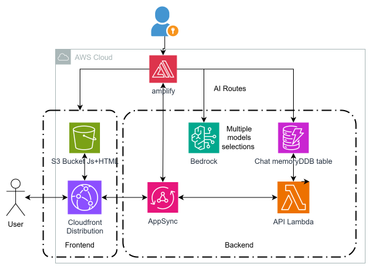

### Updated README for **Datavail Meal Planner Bot**

# Datavail Meal Planner Bot

Datavail Meal Planner Bot is a serverless, AI-powered web application that provides users with two core functionalities: a **chat interface** for conversational AI interactions and a **meal generation tool** for creating personalized recipes. The app leverages AWS Amplify for backend management, Amazon S3 for static hosting, Amazon CloudFront for content delivery, Amazon API Gateway and AWS Lambda for backend logic, Amazon DynamoDB for storing chat history, and Amazon Bedrock for AI-powered interactions. With this robust architecture, the app delivers scalable, secure, and efficient services to users.

## Key Features
1. **Chat Route**: Engage in intelligent, conversational interactions powered by AI to answer queries or provide contextual support.
2. **Meal Generation Route**: Generate personalized meal recipes, complete with ingredient quantities and detailed instructions, based on user input.

## Architecture Overview
The architecture is built on AWS services, ensuring a fully serverless and scalable deployment. The frontend is hosted on **Amazon S3**, distributed globally via **Amazon CloudFront**. Backend operations are handled by **API Gateway** and **AWS Lambda**. AI capabilities are integrated through **Amazon Bedrock** using Claude V3 models for conversation and recipe generation. Chat memory is stored securely in **Amazon DynamoDB**, ensuring context continuity across sessions. User authentication and app management are streamlined using **AWS Amplify**.



## Setup

1. Ensure your AWS account has access to Bedrock by requesting access in the [Bedrock console](https://console.aws.amazon.com/bedrock/home#/modelaccess).
2. Set up your AWS account for Amplify following this [guide](https://docs.amplify.aws/react/start/account-setup/).

## Installation

To get started, install the dependencies:

```bash
npm i
```

## Running the App

1. Start the Amplify cloud sandbox:
   ```bash
   npx ampx sandbox
   ```
   This will provision resources in your AWS account. Watch for file changes to auto-deploy backend updates.

2. Run the Vite development server in a separate terminal:
   ```bash
   npm run dev
   ```
   Log in or create an account on the provided sign-in page.

## Deploying the App

1. In the Amplify console, create a new app and connect your Git repository.
2. Configure the settings and deploy. You will get a live URL for your app after deployment.

## Cleaning Up Resources

- For sandbox resources, quit the sandbox and type `y` to clean up.
- For deployed apps, delete the app in the Amplify console to remove resources.

---
